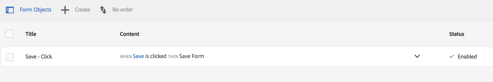

# Send user a link to the saved form

To improve the form filling experience we will allow the user to indicate if he/she wants to receive an email with a link to the draft form, after receiving the email, the user can continue filling the form on desktop or mobile. We will send the email using Adobe Campaign. To provide this functionality, we have to override the default client side behavior of the "save" button and we have to provide a service (servlet) to send the email.

(6 Steps)

## Step 1 : Implement the dialog as a client library

In exercises [exercise4](../exercise4/README.md) and [exercise5](../exercise5/README.md) we have discussed the default server-side behavior and implemented a custom server-side behavior for saving drafts. In this exercise we will have to change the client-side behavior because we want to show the user a dialog after clicking the save button. This dialog will ask the user if he/she wants to receive an email with a link to the draft form. This of cause, will only work when the user have provided an email in the email field.

* Import [packages/draft-email-handler-clientlib-1.0.zip](../packages/draft-email-handler-clientlib-1.0.zip) via [package manager](http://localhost:4502/crx/packmgr/index.jsp)
* Explore [/apps/summit-2018/tl15/draft-email-handler-clientlib/js/draftEmailHandler.js](http://localhost:4502/crx/de/index.jsp#/apps/summit-2018/tl15/draft-email-handler-clientlib/js/draftEmailHandler.js)

```javascript
$(function() {

    var draftModal = '<div id=\"draftModal\" class=\"modal fade\"><div class=\"modal-dialog\"><div class=\"modal-content\"><div class=\"modal-header\"><button type=\"button\" class=\"close\" data-dismiss=\"modal\" aria-hidden=\"true\" style=\"color:black;\">&times;</button><h4 class=\"modal-title\">Draft Saved</h4></div><div class=\"modal-body\"><p>We have saved a draft of the application filled by you.</p><p class=\"text-warning\">Would you like us to email this draft to you for future reference?</p></div><div class=\"modal-footer\"><button type=\"button\" class=\"btn btn-primary sendEmail moveNext\" style=\"padding:16px 12px;background: white;    color: #2995c9;\">Send Email</button><button type=\"button\" class=\"btn btn-primary closeBox\" style=\"display:none;\">Okay</button></div></div></div></div>';
    $('body').append(draftModal);

       $("#draftModal .sendEmail").on('click', function() {
        	console.log('In sendEmail section')
        	var draftID = guideBridge.customContextProperty('draftID')

        	var url = "/services/api/draft/mail?draftId=" + draftID;


           	$.ajax(url, {
               dataType: "text",
               success: function(rawData, status, xhr) {
                   var serverResponse;
                   try {
                       serverResponse = $.parseJSON(rawData);
                       
                       if (serverResponse.status == 'success') {
                           $('#draftModal .modal-body').html('<p>We have sent an email to you with the link to your application draft. <br>This draft will expire after 15 days.</p>')
                           $('.modal-title').html('<h4 class="modal-title">Draft Email Sent</h4>')
                           $('.btn-primary.closeBox').css('display', '').css('padding','16px 12px');
                           $(".btn-primary.sendEmail").css('display', 'none');
                       }else{
                           
                           $('#draftModal .modal-body').html('<p>Email with the link to your application draft has been sent already.</p>')
                           $('.modal-title').html('<h4 class="modal-title">Message</h4>')
                           $(".btn-primary.sendEmail").css('display', 'none');
                           
                       }
                       
                       
                   } catch (err) {
                       failure(err);
                   }
               },
               error: function(xhr, status, err) {
                   failure(err);
               }
           	});


    	});

        $('.modal-header > .close').on('click', function() {
			  $('#draftModal .modal-body').html('<p>We have saved a draft of the application filled by you.</p><p class="text-warning">Would you like us to email this draft to you for future reference?</p>')
              $('.modal-title').html('<h4 class="modal-title">Draft Saved</h4>')
              $('.btn-primary.closeBox').css('display', 'none');
              $(".btn-primary.sendEmail").css('display', '');
   		});

     	$(".btn-primary.closeBox").on('click', function() {
           $('.modal-header > .close').click();

   		});

});

```

* We recover the draftId using the guidebrigde-object : guideBridge.customContextProperty('draftID')
* And pass it as a parameter to a url that maps to a custom servlet
* Set the clientlib's [/apps/summit-2018/tl15/draft-email-handler-clientlib](http://localhost:4502/crx/de/index.jsp#/apps/summit-2018/tl15/draft-email-handler-clientlib) category to "draft-email-handler-clientlib"

## Step 2 : Use the client library in the form

* Open your [form](http://localhost:4502/aem/forms.html/content/dam/formsanddocuments) in edit mode
* Toggle the side panel if needed
* Select the "Adaptive Form Cantainer" from the "Form Object" in the side pabel
* Click "Configure"
* Specify "draft-email-handler-clientlib" as the value for "Client Library Category"
* Click "Done" (upper right in the side panel, color is blue in case of non-saved changes)

## Step 3 : Change the "save"-buttons client-side behavior

* In the form, click the "save" button in the toolbar
* Select the "Edit Rules" (hammer-icon) from the context menu
* This is how the dafult rule looks like



* Select the "Save - Click" rule and click "Edit"
* Click "Visual Editor" on the right select "Code Editor" from the list
* Click "Edit Code"
* Acknowledge the dialog ("Edit")
* Change the default generated code

```javascript
handleDraftSave(this);
```
* Into 

```javascript
handleDraftSave(this);
$("#draftModal").modal('show');
```
* Click "Done"
* Click "Close"

## Step 4 : Deliver the email

* The [TL15UtilityServlet.java](../resources/TL15UtilityServlet.java) is already deployed as part of the bundle [summit.lab.tl15-bundle-0.0.1-SNAPSHOT.jar](resources/summit.lab.tl15-bundle-0.0.1-SNAPSHOT.jar) deployed as part of setup [exercise 1](../exercise1/README.md).

This servlet will receive the "draftId" from the ajax call in the dialog. The draftId allows us to retrieve the form metadata using the configured DraftMetadataService.getProperty() method. Because we want to send an email we need the actual form data that is saved onto our filesystem using our custom implementation of the DraftDataService [exercise5](../exercise5/README.md). The form data stores the email address. The "userdataID" stored as part of the draft form's metadata will allow to identify the form data using the DraftDataService.getData() method.

The getTransactionalMessagePayload will prepare the payload for the adobe.io call to Adobe Campaign. AdobeIORequestProcessor is a library that provide a java api on top of Adobe Campaign's REST api.

```java

...

import com.adobe.fd.fp.service.DraftDataService;
import com.adobe.fd.fp.service.DraftMetadataService;

@Properties({
 @Property(name = Constants.SERVICE_VENDOR, value = "Adobe Benelux Presales"),
 @Property(name = Constants.SERVICE_DESCRIPTION, value = "Summit 2018 - TL15 - Utilities Servlet")
})
@SlingServlet(
     paths={"/services/api/draft/mail"}
)
public class TL15UtilityServlet extends SlingSafeMethodsServlet {

	private static final Logger logger = LoggerFactory.getLogger(TL15UtilityServlet.class);
	private static final String APPLICATION_JSON = "application/json";

	// Lookup custom FileDraftDataServiceImpl
	@Reference(target="(aem.formsportal.impl.prop=summit.tl15formsportal.file.draft.dataservice)")
	private DraftDataService draftDataService;
	
	// Lookup standard crx draft metadata implementation
	@Reference(target="(aem.formsportal.impl.prop=com.adobe.fd.fp.service.impl.DraftMetadataServiceImpl)")
	private DraftMetadataService draftMetadataService;
	
	@Reference
	private AdobeIORequestProcessor adobeIORequestProcessor;

	@Override
	protected void doGet(SlingHttpServletRequest request,
			SlingHttpServletResponse response) throws ServletException,
			IOException {
	
		System.out.println("sendSavedFormLink - start");
		
		try {
			String draftId = request.getParameter("draftId");
									
			// Use the configured draftMetadataService (default = crx)
			
			String userdataID = draftMetadataService.getProperty(draftId,"userdataID")[0];
			
			logger.info("userdataID : " + userdataID );
			
			// Use the configured draftDataService (custom = file based for lab TL15)
			
			byte draftData[] = draftDataService.getData(userdataID);
			
			// Transform the formdata into a JSON object that is compliant with the structure required by the
			// Adobe Campaign event configured for our purpose
			
			JSONObject transactionalMessagePayload = getTransactionalMessagePayload(draftId, draftData);
			
			// Invoke the Adobe Campaign transactional message api via Adobe IO
			
			String ignore = adobeIORequestProcessor.processMC(transactionalMessagePayload.toString());
			
			// For this lab TL15 we ignore the errors and always return status = success ;)
			
			JSONObject responseJson = new JSONObject();
			responseJson.put("status", "success");
			
			response.setContentType(APPLICATION_JSON);
			PrintWriter pw = response.getWriter();
			
			pw.print(responseJson);
			
		} catch (Exception e) {
			e.printStackTrace();
			throw new ServletException(e.getMessage());
		}
		
		System.out.println("sendSavedFormLink - done");
		
	}
			
	private JSONObject getTransactionalMessagePayload(String draftId, byte data[]) throws Exception {
	
		String formDataString = new String(data);
		
		JSONTokener jT = new JSONTokener(formDataString);
		
		JSONObject formDataJson = new JSONObject(jT);
		
		JSONObject identityJson = formDataJson.getJSONObject("afData").getJSONObject("afBoundData").getJSONObject("data").getJSONObject("profile").getJSONObject("identity");
		
		String email = identityJson.getString("email");
		String labmachinelabel = identityJson.getString("labmachinelabel");
		
		logger.info("email : " + email);
		logger.info("labmachinelabel : " + labmachinelabel);
		
		JSONObject confirmationEmailJson = new JSONObject();
		confirmationEmailJson.put("mcEvent", "EVTSendFormsDraftLink"); // EVTttsTicketConfirmation

		JSONObject mcPayloadEmailJson = new JSONObject();
		confirmationEmailJson.put("mcPayload", mcPayloadEmailJson);
		
		mcPayloadEmailJson.put("email", email);
		
		JSONObject emailCtx = new JSONObject();
		
		emailCtx.put("email", email);			
		emailCtx.put("draftId", draftId);
		emailCtx.put("labmachinelabel", labmachinelabel);
		
		mcPayloadEmailJson.put("ctx", emailCtx);
		
		logger.info("confirmationEmailJson >> " + confirmationEmailJson.toString());
		
		return confirmationEmailJson;		
	}
}
```

## Step 5 : Test

* Preview your form
* Provide a couple of values
* Specify a valid "email" address (preferably your own)
* Save the form
* The dialog asking to send link should appear
* Click "Send Email"

## Step 6 : Check Your email

The Adobe Campaign instance we use in this demo, sends all emails to a sandbox environment. You can access this environment via this [web based email client](https://marcmeewis-230217.campaign-demo.adobe.com/webmail/?_task=mail&_mbox=INBOX). Login with user "demo", the password will be communicated during the TL15 lab. The email client will show all mails send during this lab. Make sure that you open your own email. Your mail will have a subject beginning with your "machine label" CSxx-xxx that you entered as part of the form data.

* Indentify your email
* Click the "Account Opening"-link
* Your draft form should display the previously entered data.
