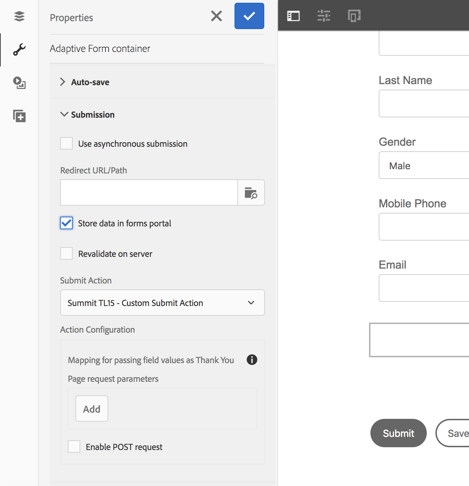

# 9. Custom Submit Actions

In this exercise we will create a submit action that registers our profile with Adobe Campaign. The submit action will trigger an Adobe IO call to create a profile in Adobe Campaign.

# The anatomy of a custom submit action

A Submit action is a sling:Folder that includes the following: 

* addfields.jsp: This script provides the action fields that are added to the HTML file during rendition. Use this script to add hidden input parameters required during submission in the post.POST.jsp script.
* dialog.xml: This script is similar to the CQ Component dialog. It provides configuration information that the author customizes. The fields are displayed in the Submit Actions Tab in the Adaptive Form Edit dialog when you select the Submit action.
* post.POST.jsp: The Submit servlet calls this script with the data that you submit and the additional data in the previous sections. Any mention of running an action in this page implies running the post.POST.jsp script. To register the Submit action with the adaptive forms to display in the Adaptive Form Edit dialog, add these properties to the sling:Folder:

     * guideComponentType of type String and value fd/af/components/guidesubmittype
     * guideDataModel of type String that specifies the type of adaptive form for which the Submit action is applicable. xfa is supported for XFA-based adaptive forms while xsd is supported for XSD-based adaptive forms. basic is supported for adaptive forms that do not use XDP or XSD. To display the action on multiple types of adaptive forms, add the corresponding strings. Separate each string by a comma. For example, to make an action visible on XFA- and XSD-based adaptive forms, specify the values xfa and xsd respectively.
     * jcr:description of type String. The value of this property is displayed in the Submit action list in the Submit Actions Tab of the Adaptive Form Edit dialog. The OOTB actions are present in the CRX repository at the location /libs/fd/af/components/guidesubmittype.

## Setup Custom submit action

* Deploy the package [packages/tl15-custom-submit-actions-1.0.zip](../packages/tl15-custom-submit-actions-1.0.zip) using [package manager](http://localhost:4502/crx/packmgr/index.jsp)
* Install the package

## Configure the submit action

* Navigate to [/apps/summit-2018/tl15/components/guidesubmittype/acssubmit/post.POST.jsp](http://localhost:4502/crx/de/index.jsp#/apps/summit-2018/tl15/components/guidesubmittype/acssubmit/post.POST.jsp) in CRX DE
* Select "acssubmit", look at "jcr:description", this is the name that will appear in the "Submit Action" select list when configuring your form.
* Open /apps/summit-2018/tl15/components/guidesubmittype/acssubmit/post.POST.jsp

```java
<%

    logger.log("ACS Submit Action triggered");

    // Obtain your ACS Connector Service

    // Get the form data

    // Create the profile in Adobe Campaign (Adobe IO)

    // Get the redirect parameters

    // Perform the required redirect 
    
    logger.log("ACS Submit Action done");

%>
```

Add the following code snippets to your post.POST.jsp.

### Obtain your ACS Connector Service

We wil use a wrapper service (ACSConnector) around an Adobe IO library that will create/update or profile in Adobe Campaign. A

``` java
// Obtain your ACS Connector Service
ACSConnector acsConnector = sling.getService(ACSConnector.class);

```

### Get the form data that was submitted

The FormSubmitInfo object can be retrieved from the request object. The getData() method returns the form data.

```java
// Get the form data
FormSubmitInfo submitInfo = (FormSubmitInfo) request.getAttribute(GuideConstants.FORM_SUBMIT_INFO);
logger.info("Form submit data : " + submitInfo.getData());
```

### Create the ACS profile from the form data

The [ACS Connector's](../resources/ACSConnectorImpl.java) createProfile method is a wrapper around an Adobe IO library which exposes REST methods as plain java calls.

```java
// Create the profile in Adobe Campaign (Adobe IO)
String acsResponse = acsConnector.createProfile(submitInfo.getData());
logger.info("acsResponse : " + acsResponse);
```

### Retrieve the redirect parameters

```java
// Get the redirect parameters
Map<String,String> redirectParameters;
redirectParameters = GuideSubmitUtils.getRedirectParameters(slingRequest);
if(redirectParameters==null) {
	redirectParameters = new HashMap<String, String>();
}
```

### Peform the required redirect

```java
// Perform the required redirect 
GuideSubmitUtils.setRedirectParameters(slingRequest,redirectParameters);
```

## Configure your form to use the custom submit action

* Open your form created during [exercise2](../exercise2/README.md)
* In authoring mode, select any component, from the context menu select parent, from the list select "Adaptive Form container"
* Scroll down and select "Configure" from the context menu
* Select "Submission" in the configuration panel
* Check "Store data in forms panel"
* Select "Summit TL15 - Custom Submit Action" from the Submit Action list
* Click "Done" (upper right in the configuration panel)

This is how your configuration panel should look like:



## Test your form

* Preview your form, fill all the "Identity" fields 
* Make sure that your use your Lab Machine Label CSXX-XXX as the value for the field "Cus Labmachinelabel"
* Click Submit
* Check your error.log

## Check if your profile has been created

To check if your profile has been created in Adobe Campaign, you can execute the following url

[http://localhost:4502/services/api/acs/profileByLabmachinelabel?labmachinelabel=CS12-123](http://localhost:4502/services/api/acs/profileByLabmachinelabel?labmachinelabel=<YOUR LAB MACHINE LABEL>)

The response should look like:

``` json
{
	"content": [{
		"PKey": "@4W1bK-5q0Icicnaf4EHUhZWyb-oXBTw1cSen3YxvSokZS26Vu-WybUFMqmH3tZQPMPzyGISzUvGYivpW7VxjFEFUmQo",
		"age": 0,
		"birthDate": "",
		"blackList": false,
		"blackListEmail": false,
		"blackListFax": false,
		"blackListMobile": false,
		"blackListPhone": false,
		"blackListPostalMail": false,
		"blackListPushnotification": false,
		"created": "2018-02-21 09:26:57.584Z",
		"cryptedId": "GfEg9uI5pvlz0upprPaTc+bXYSNQc0GElI59HAqH6Zi+gjDLWGzuu4gSPFiHx3ycTo1h9A==",
		"cusCrmid": "",
		"cusLabmachinelabel": "CS542-23",
		"cusLeadid": "",
		"domain": "adobe.com",
		"email": "mmeewis@adobe.com",
		"emailFormat": "unknown",
		"fax": "",
		"firstName": "Marc",
		"gender": "male",
		"href": "https://mc.adobe.io/marcmeewis-230217.campaign-demo.adobe.com/campaign/profileAndServicesExt/profile/@4W1bK-5q0Icicnaf4EHUhZWyb-oXBTw1cSen3YxvSokZS26Vu-WybUFMqmH3tZQPMPzyGISzUvGYivpW7VxjFEFUmQo",
		"isExternal": false,
		"lastModified": "2018-04-03 14:24:29.562Z",
		"lastName": "Meewis",
		"location": {
			"address1": "",
			"address2": "",
			"address3": "",
			"address4": "",
			"city": "",
			"countryCode": "",
			"stateCode": "",
			"zipCode": ""
		},
		"middleName": "",
		"mobilePhone": "",
		"phone": "",
		"postalAddress": {
			"addrDefined": false,
			"addrErrorCount": 0,
			"addrLastCheck": "",
			"addrQuality": "0",
			"line1": "Marc MEEWIS",
			"line2": "",
			"line3": "",
			"line4": "",
			"line5": "",
			"line6": "",
			"serialized": "Marc MEEWIS\n\n\n\n\n"
		},
		"preferredLanguage": "none",
		"salutation": "",
		"subscriptions": {
			"href": "https://mc.adobe.io/marcmeewis-230217.campaign-demo.adobe.com/campaign/profileAndServicesExt/profile/@4W1bK-5q0Icicnaf4EHUhZWyb-oXBTw1cSen3YxvSolV2z9hLSDZIIAurg4bJCwwotExHmV7QewYEpgSnXlRZCE05Zw/subscriptions/"
		},
		"thumbnail": "/nl/img/thumbnails/defaultProfil.png",
		"timeZone": "none",
		"title": "Marc Meewis (mmeewis@adobe.com)"
	}],
	"count": {
		"href": "https://mc.adobe.io/marcmeewis-230217.campaign-demo.adobe.com/campaign/profileAndServicesExt/profile//byLabmachinelabel/_count?labmachinelabel_parameter=CS542-23&_lineStart=@V6qffHpTFynfhZ__bzIDMDHx2x0-exnBzat6TFhASdMTSpTe",
		"value": 1
	},
	"serverSidePagination": true
}
```
