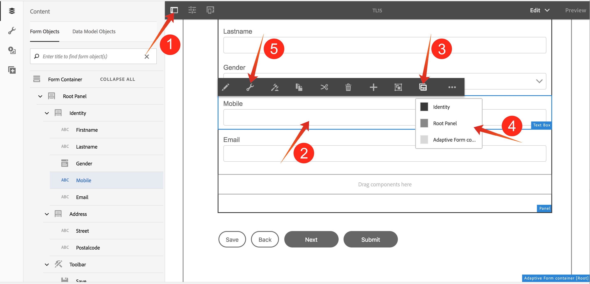

# Generic Info

## How to activate the configuration panel for a form component

* 1 : Activate the configuration panel in form "edit" mode
* 2 : Select a component (Mobile field in the example)
* 3 : Select the "parent" if you want to select a component higher up in the hierarchy, parents from bottom to top will be listed
* 4 : Select the desired parent
* 5 : From the context menu that appears, select "configure" and make the required changes via the configuration panel and save your changes via the "Done" button. This button is diplayed in blue to indicate non-saved changes.
